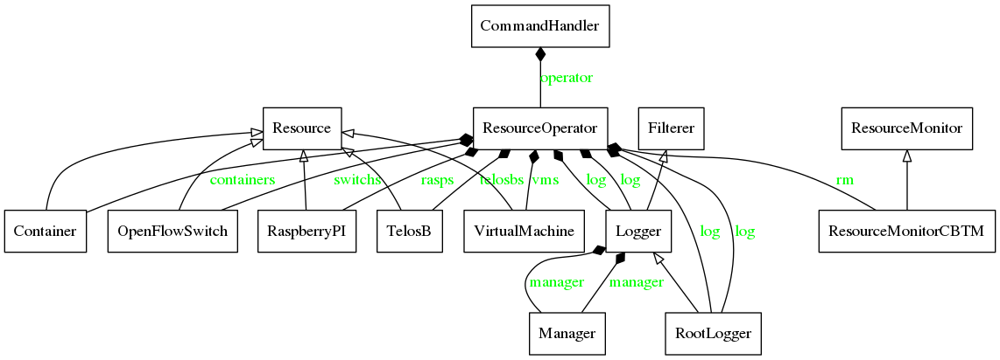

# Classes Description

 

### NodeCBTM

* **Description:** Abstract Class that represents a basic node in the testbed.
* **Location:** cbtm_node.py

### HostCBTM

* **Description:** Class that represents a user that are using a resource in the testbed.
* **Location:** cbtm_host.py

### Container, VirtualMachine, USRP, TelosB, SwitchOpenFlow, RaspberryPI

* **Description:** Classes that represents each resource in the testbed.
* **Location:** Container.py, VirtualMachine.py, USRP.py, TelosB.py, SwitchOpenFlow.py, RaspberryPI.py

<!---

*In Construction*

### Prerequisites

In order to execute the RCBTM, the following softwares are needed: 

```
apt-get install python (version)
In Construction
```

### Installing

```
In Construction
```

## Running the tests

```
In Construction
```

## Deployment

In Construction

## Built With

* [In Construction](site: In Construction) - In Construction

## Contributing

In Construction

## License

This project is licensed under the MIT License - see the [LICENSE.md](LICENSE.md) file for details

## Acknowledgments

In Construction

-->
