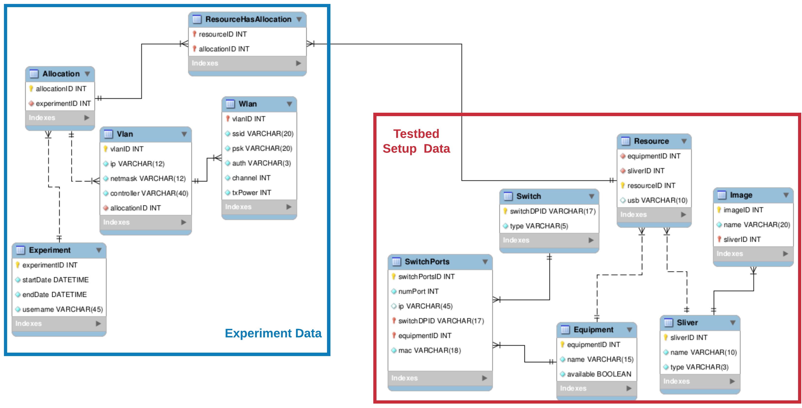

# Testbed Core  

### Description  

This repository holds code which can be shared across testbed softwares deployed in all FUTEBOL partners, such as CBTM.  

The goal of this repository is to incrementally build a modular solution that can be shared across FUTEBOL testbeds in all partners. Our first action was to come up with a database model which can abstract enough details to cover the implementation on all testbeds.  

Our first model is depicted below:  
  

The part outlined in red represents data relative to testbed setup, for example testbed equipments and how they represent available resources. The part outlined in blue represents experimentation details, such as allocated resources and the established VLANs.  

This model is an initial draft, more refinements will come soon.  